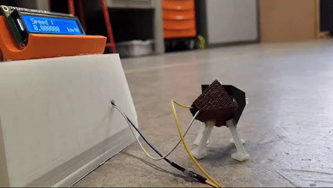

# STM32 Ultrasonic Speed Demonstrator

STM32L475 prototype that estimates object speed from two HC-SR04 distance measurements taken 200 ms apart. A 16×2 LCD shows measurements and an LED signals when the configured threshold is exceeded.

## Repository guide

| Location | Contents |
|---|---|
| [src/](src/) | HAL-based distance measurement and application source |
| [documentation/](documentation/) | Project report and presentation |
| [assets/](assets/) | Prototype photos, demonstration and configuration captures |

## Getting started

Use STM32CubeIDE and the STM32L4 HAL. The report describes the pin configuration and timer setup; the source must be integrated with the board initialization and LCD driver.

## Project context

Academic project with Greg Alberts. The ultrasonic sensor measures changes in range along its line of sight, which limits how the speed estimate should be interpreted.
