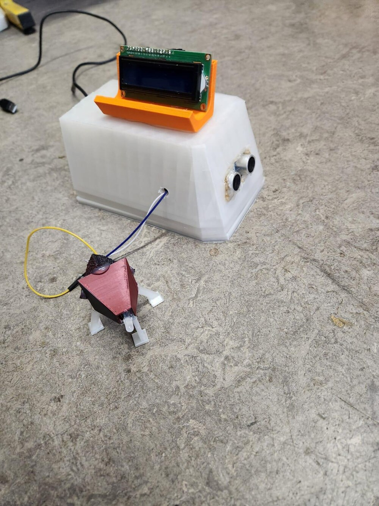
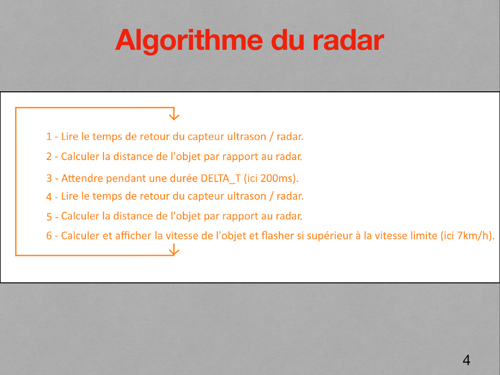
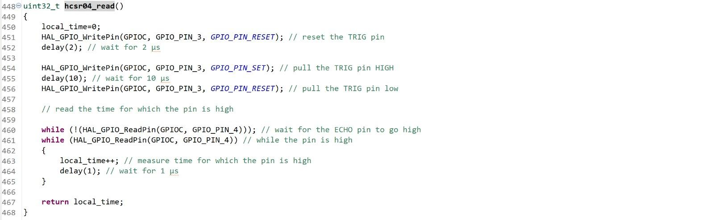
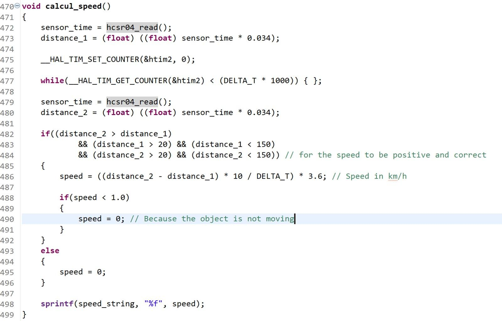
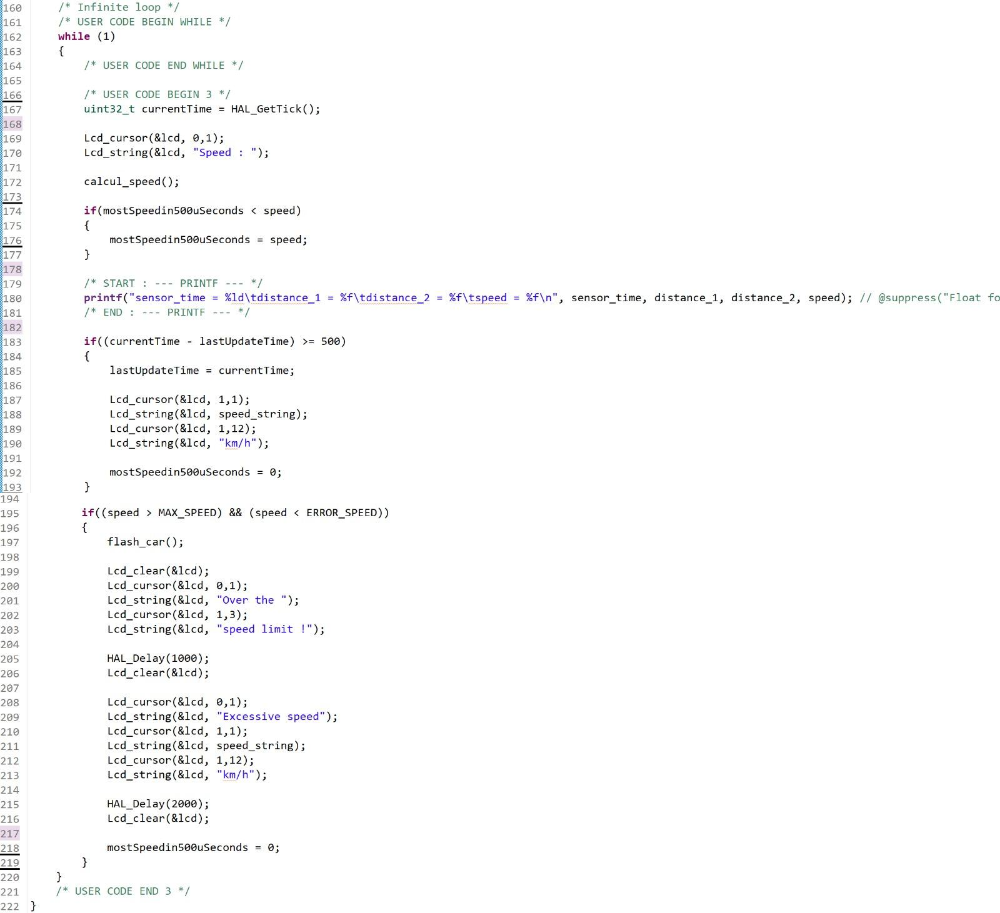

# STM32 Ultrasonic Speed Measurement Prototype

STM32 ultrasonic demonstrator estimating speed from successive distance measurements.

**Embedded C · STM32L4 · STM32 HAL · Timers · GPIO · Ultrasonic Sensing · ITM Debugging**



*Prototype enclosure with a character LCD on top and the HC-SR04 sensor on the front.*


*Demonstration of the LED flash associated with the 7 km/h threshold.*

## Project Overview

The project combines sensor interfacing, timing, distance-to-speed conversion and user feedback in a physical prototype.

| Item | Details |
|---|---|
| Context | Second-year engineering project, Instrumentation, Sup Galilée, Université Sorbonne Paris Nord |
| Course | Microcontroller 2 |
| Team | Tedj El Moulk Sinacer and Greg Alberts |
| Status | Completed academic prototype; not actively maintained |
| Repository scope | Intermediate distance-measurement source, final-program screenshots, prototype media and project documentation |

The name “radar” refers to the original project theme. The measurement principle is ultrasonic time of flight, rather than radio-frequency radar.

## Hardware and Tools

| Component | Details |
|---|---|
| Microcontroller | STM32L475VGTx |
| Distance sensor | HC-SR04 ultrasonic sensor |
| Sensor connections | TRIG: PC3; ECHO: PC4 |
| Display | 16 × 2 character LCD, 4-bit interface |
| Indicator | White LED used as a flash |
| Development tools | STM32CubeIDE and STM32CubeMX |
| Firmware interfaces | STM32L4 HAL |
| Clock configuration | 80 MHz system clock using MSI and PLL |
| Timer | TIM1, prescaler 79, giving a nominal 1 MHz counter clock |
| Debug output | ITM, with `printf` redirected through `_write()` |

[CubeMX pin configuration](assets/brochage_cubemx.png)

## Measurement Principle

### Distance

A 10 µs pulse on TRIG starts an ultrasonic measurement. The duration of the ECHO pulse represents the sound's round trip to the object.

Using a sound-speed assumption of 340 m/s:

```text
distance_cm = echo_duration_us × 0.034 / 2
```

This equation requires an accurate measurement of the echo duration. The available source uses a polling-loop approximation, described under limitations below.

### Speed

The documented final demonstrator estimates speed from two distance measurements separated by a nominal 200 ms interval:

```text
speed_kmh = ((distance_2_cm - distance_1_cm) / 100) / delta_t_s × 3.6
```

The measurement represents motion along the sensor's line of sight.

The documented acceptance rules are:

- both distances must be between 20 and 150 cm;
- the object must be moving away from the sensor;
- estimates below 1 km/h are treated as zero;
- the flash condition is strictly above 7 km/h and below 20 km/h.

| Parameter | Value | Purpose |
|---|---|---|
| `DELTA_T` | 200 ms | Nominal interval between distance measurements |
| `MAX_SPEED` | 7 km/h | Demonstration flash threshold |
| `ERROR_SPEED` | 20 km/h | Upper rejection threshold |

These thresholds are intended for a small-scale demonstrator. No road-vehicle measurement capability or calibrated accuracy is claimed.

## Documented Demonstrator Workflow

1. Measure the first distance.
2. Wait for the nominal measurement interval.
3. Measure the second distance and evaluate validity.
4. Calculate the speed estimate.
5. Update the LCD.
6. Trigger the LED flash when the threshold condition is met.



*Original project algorithm diagram, retained in French.*

## Available Source Code

The repository includes [`src/main_distance_hcsr04.c`](src/main_distance_hcsr04.c), an intermediate firmware version that measures distance and prints it through ITM, with a 500 ms delay between readings.

| Function | Implementation in the available source |
|---|---|
| `SystemClock_Config()` | Configures MSI and PLL for the system clock |
| `MX_GPIO_Init()` | Configures PC3 as TRIG output and PC4 as ECHO input |
| `MX_TIM1_Init()` | Configures TIM1 with a nominal 1 µs counter tick |
| `delay()` | Resets TIM1 and waits for a requested counter value |
| `hcsr04_read()` | Generates TRIG and estimates ECHO duration through polling |
| `_write()` | Redirects character output to ITM |

**The final speed calculation, LCD output and flash functions are preserved as screenshots, not as compilable source files.**

### Final-Program Screenshots







## Repository Structure

| Path | Contents |
|---|---|
| `src/main_distance_hcsr04.c` | Intermediate distance-measurement firmware |
| `assets/` | Prototype photo, demonstration GIF, algorithm, pin configuration and code screenshots |
| `documentation/rapport_radar_stm32.pdf` | Project report |
| `documentation/presentation_radar.pdf` | Project presentation |

## Build and Reproduction Status

Use the available application source as the entry point for a board-specific STM32CubeIDE project. The dependency list below identifies the hardware-support and application pieces needed for the complete demonstrator.

Reproduction requires:

- the board configuration and CubeMX `.ioc` file, or an equivalent recreated configuration;
- `main.h`, HAL/CMSIS dependencies and peripheral support files;
- startup code, linker script and build configuration;
- the final application source for speed estimation, LCD output and LED control;
- the LCD driver and its applicable licence.

The project documents Olivier Van den Eede's `lcd.c` / `lcd.h` driver as its display dependency; retain its attribution when restoring the LCD integration.

Start with the standalone distance path, then integrate the final speed/display logic and check timing at each interface.

## Demonstration and Validation

The prototype brings together ultrasonic acquisition, numerical speed estimation and immediate user feedback. The photos and GIF show the assembled sensing/display chain and threshold indication; the firmware and algorithm explain how those outputs are produced.

The photo and GIF document the physical prototype and its threshold indication. The available intermediate source demonstrates ultrasonic-sensor interfacing and ITM distance output.

The media illustrate end-to-end demonstrator behaviour. Quantitative characterisation would compare timestamped distance/speed estimates with a reference under controlled trajectories, keeping timing error separate from acoustic and geometric effects.

## Technical Limitations

| Limitation | Consequence |
|---|---|
| Echo duration estimated by counting polling-loop iterations containing `delay(1)` | GPIO reads and loop overhead add time; one iteration is not exactly 1 µs |
| No timeout while waiting for ECHO transitions | Missing or stuck ECHO can block the application |
| Distance stored as `uint32_t` | Fractional centimetres are truncated |
| Speed derived from two distance measurements | Distance noise propagates into the speed estimate |
| Fixed sound-speed assumption | Environmental effects are not compensated |
| Nominal inter-measurement delay | Actual timing should be measured when evaluating speed accuracy |
| Final source and build dependencies missing | The complete demonstrator is not reproducible from this repository alone |

In the available source, the comment beside `delay(1)` mentions 10 µs, while the argument requests 1 µs. The implementation and documentation need to be kept consistent.

## Engineering Development Priorities

The next engineering iteration follows these priorities:

1. Restore the complete CubeIDE project and final firmware.
2. Measure ECHO edges using timer input capture, with a timeout and explicit validity status.
3. Timestamp measurements and use the actual elapsed interval for speed estimation.
4. Preserve fractional distance values and assess filtering based on measured noise.
5. Compare distance and speed estimates against references, documenting error and repeatability.
6. Separate the sensor driver, speed estimation and display logic into modules.

## Documentation

- [Project report — PDF, French](documentation/rapport_radar_stm32.pdf)
- [Project presentation — PDF, French](documentation/presentation_radar.pdf)

## Authors and Licensing

Project developed by **Tedj El Moulk Sinacer** and **Greg Alberts**.

No project-wide licence has been specified. The STM32CubeMX-generated source retains its STMicroelectronics copyright and licence notice.
