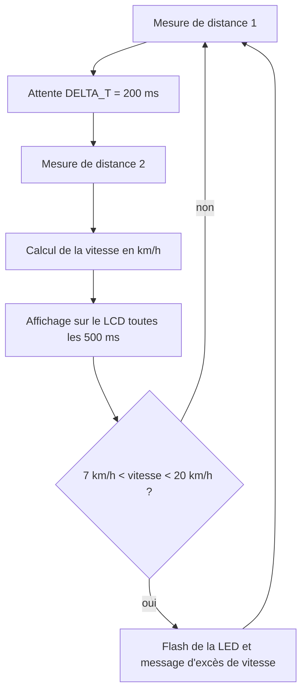

# Radar de route sur STM32

Maquette de radar routier : un capteur à ultrasons HC-SR04 mesure deux fois la distance d'un objet à 200 ms d'intervalle, une carte STM32 en déduit une vitesse, l'affiche sur un LCD et fait clignoter une LED si le seuil est dépassé.


*Démonstration : la LED flashe lorsque la vitesse mesurée dépasse 7 km/h.*
*Prototype : boîtier avec l'afficheur LCD sur le dessus et le capteur HC-SR04 en façade.*

## Sommaire

1. [Présentation](#présentation)
2. [Matériel et outils](#matériel-et-outils)
3. [Principe de mesure](#principe-de-mesure)
4. [Algorithme](#algorithme)
5. [Détail du code](#détail-du-code)
6. [Contenu du dépôt](#contenu-du-dépôt)
7. [Limites](#limites)

## Présentation

- **Cadre** : projet « Microcontrôleur 2 », deuxième année du cycle ingénieur Instrumentation, Sup Galilée (Université Sorbonne Paris Nord).
- **Équipe** : projet réalisé en binôme avec Greg Alberts.
- **État** : projet académique terminé, non maintenu.

## Matériel et outils

| Élément | Détail |
|---|---|
| Carte | STM32L475 (microcontrôleur STM32L475VGTx) |
| Capteur | Ultrasons HC-SR04 : TRIG sur PC3, ECHO sur PC4 |
| Affichage | LCD 2 × 16 en mode 4 bits |
| Signalisation | LED blanche (flash) |
| Outils | STM32CubeIDE, configuration CubeMX, bibliothèque HAL STM32L4 |
| Horloge | 80 MHz (MSI + PLL), timer TIM1 avec prédiviseur 79, soit 1 tick par microseconde |

## Principe de mesure

1. Une impulsion de 10 µs est envoyée sur TRIG.
2. La durée de l'état haut sur ECHO est mesurée en microsecondes.
3. La distance vaut `durée × 0,034 / 2` en centimètres (vitesse du son 340 m/s, aller-retour).
4. Deux distances mesurées à `DELTA_T = 200 ms` d'intervalle donnent une vitesse, convertie en km/h.

Une mesure n'est retenue que si les deux distances sont comprises entre 20 et 150 cm et si l'objet s'éloigne ; sinon la vitesse est mise à zéro. Une vitesse inférieure à 1 km/h est considérée comme nulle.

## Algorithme




| Constante | Valeur | Rôle |
|---|---|---|
| `DELTA_T` | 200 ms | Intervalle entre les deux mesures |
| `MAX_SPEED` | 7 km/h | Seuil de déclenchement du flash |
| `ERROR_SPEED` | 20 km/h | Au-delà, la mesure est considérée comme aberrante |

## Détail du code

| Fonction | Rôle |
|---|---|
| `delay(us)` | Attente en microsecondes par lecture du compteur de TIM1 |
| `hcsr04_read()` | Déclenche le capteur et renvoie la durée de l'écho |
| `calcul_speed()` | Effectue les deux mesures et calcule la vitesse |
| `flash_car()` | Fait clignoter la LED |

Extraits du programme final (captures issues du rapport) :


Brochage configuré dans CubeMX : [`assets/brochage_cubemx.png`](assets/brochage_cubemx.png).

## Contenu du dépôt

```
src/main_distance_hcsr04.c   Étape intermédiaire : mesure et affichage de la distance seule
assets/                      Photo du prototype, algorithme, captures du programme final
```

Le fichier `src/main_distance_hcsr04.c` est le `main.c` généré par CubeMX, complété par `delay()` et `hcsr04_read()`. Il envoie la distance sur la sortie de débogage (ITM) toutes les 500 ms.

## Limites

- **Programme final non conservé en source** : le calcul de vitesse, l'affichage LCD et le flash n'existent ici que sous forme de captures. Le projet CubeIDE complet (fichier `.ioc`, pilotes HAL, `main.h`) n'est pas dans le dépôt, qui ne se compile donc pas tel quel.
- **Afficheur LCD** : le pilote utilisé est une bibliothèque tierce (`lcd.c` / `lcd.h`, Olivier Van den Eede) ; elle n'est pas redistribuée ici.
- **Précision** : aucune mesure de précision n'a été faite. La vitesse repose sur deux distances proches dans le temps, donc sensible au bruit du capteur ; la plage utile est limitée à 20–150 cm.
- **Seuils** : 7 km/h est un seuil de démonstration adapté à une maquette, pas à un véhicule réel.
- **Mesure bloquante** : l'attente de l'écho n'a pas de délai de garde ; sans écho, le programme reste bloqué.

## Licence

Aucune licence n'a été définie pour ce code. L'en-tête du fichier généré par CubeMX reste soumis aux conditions de STMicroelectronics.
